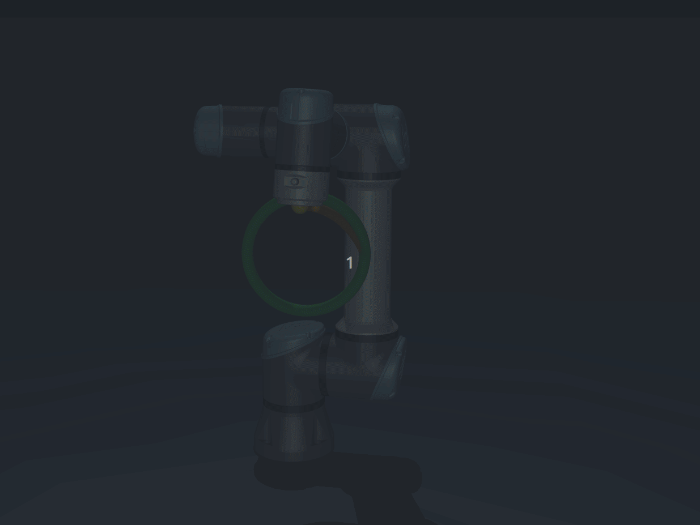
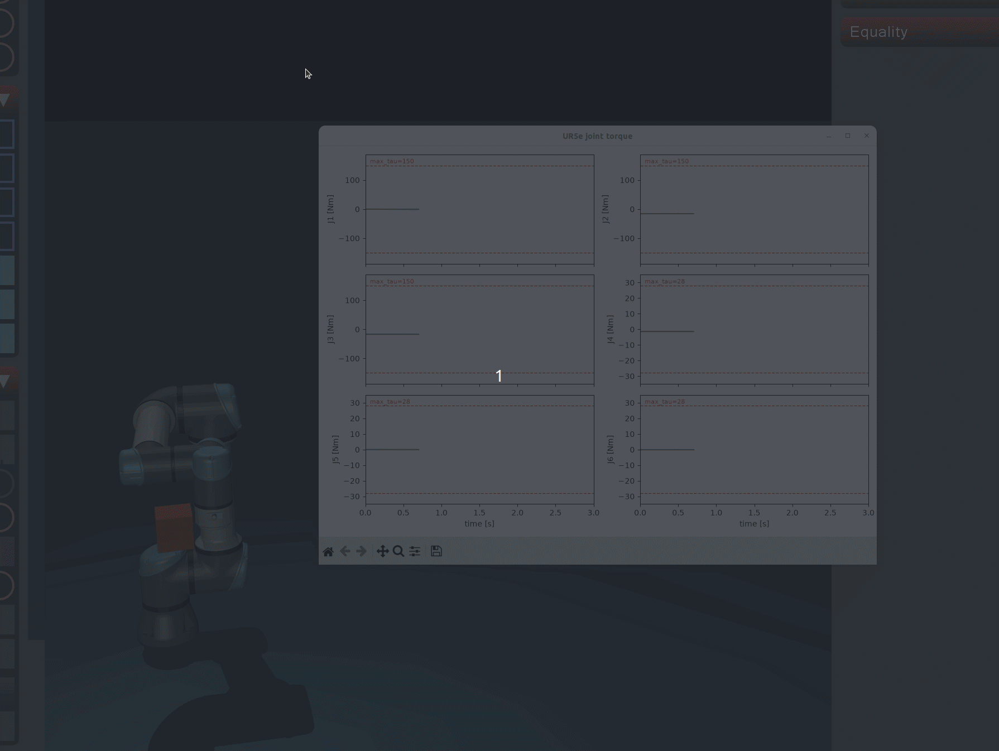

# ctc_controller

关节空间 **计算力矩控制（CTC / inverse dynamics）** 的 C++ 工程库。不含 ROS。动力学来自 **URDF / MJCF + Pinocchio**。

## 编译

```bash
conda activate gct
cd /home/l/ctc_controller
cmake -S . -B build
cmake --build build -j
cmake --build build --target ctc_mujoco_scene ctc_mujoco_scene_obstacle
```

依赖：Eigen3、Pinocchio、MuJoCo Python、matplotlib（Demo 2）。

## Demo 1：高速圆轨迹 vs PID

TCP 平均速度 `0.6 m/s`，同一条参考轨迹对比 CTC 与纯关节位置 PID。

```bash
cmake --build build --target ur5e_circle_demo
python examples/ur5e_figure8_demo.py --headless   # 只输出 RMSE
```


| 控制器     | 末端 RMSE  | 末端最大误差    |
| ------- | -------- | --------- |
| CTC     | 4.56 mm  | 18.31 mm  |
| 纯位置 PID | 76.72 mm | 137.51 mm |


CTC 末端 RMSE 改善 **94.1%**。按 **空格** 开始可视化。



## Demo 2：力矩限幅验证

机械臂顶障碍物，验证 `tau_abs_max` 是否生效。默认 UR5e 上限 `150,150,150,28,28,28 Nm`。

```bash
cmake --build build --target ur5e_obstacle_torque_demo
```



## 测试

```bash
ctest --test-dir build --output-on-failure
```

